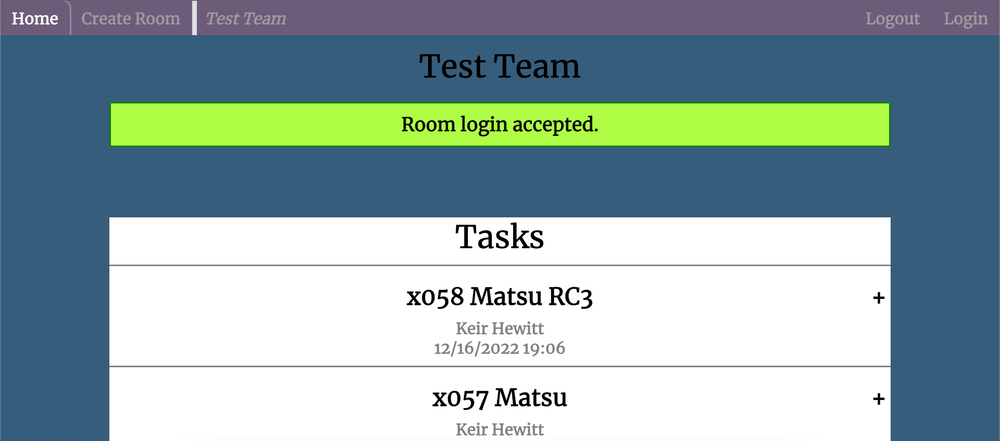

# ProjectManagementApp

**A basic task managment app built using Python Flask with Jinja2 HTML templating**

 - Login as a unique user
 - Create rooms which require credentials to access
 - Create tasks which are specific to each room

